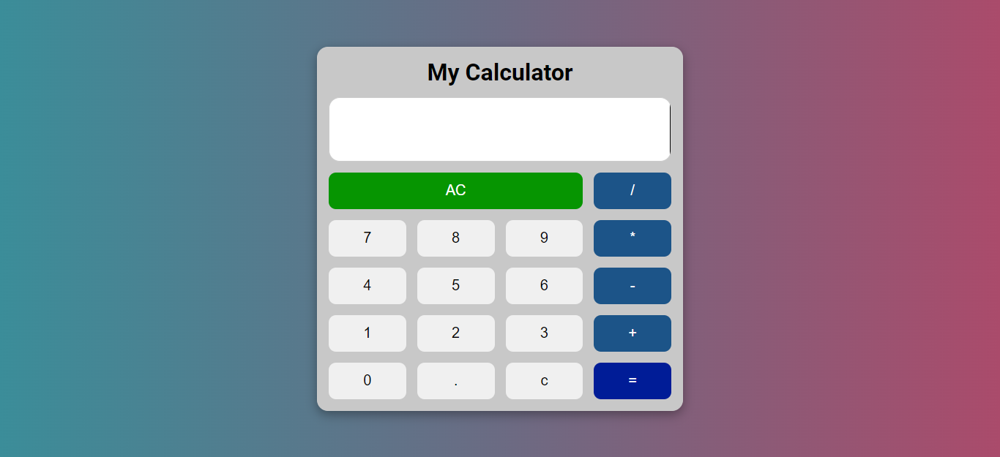
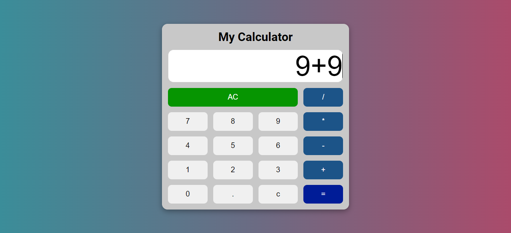

# Calculator

A simple calculator using HTML, CSS, and JavaScript. This calculator used function() instead of eval(), because its the best practice to use funbtion() than eval().

## Overview of the project.

